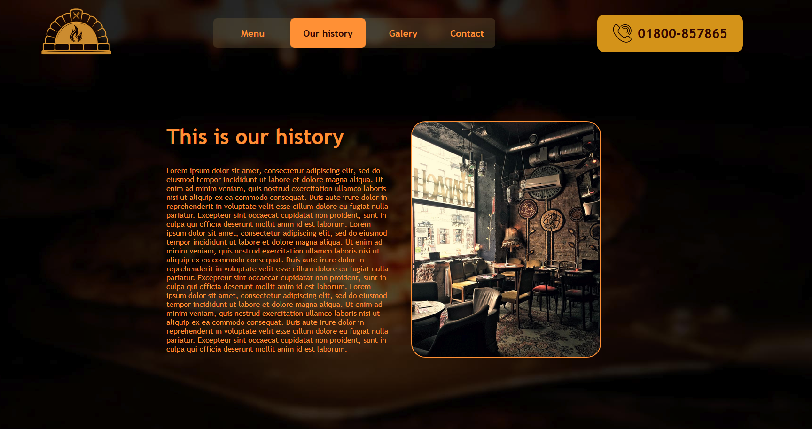

# Restaurant Landing page

> I base this Project on the practice for DOM manipulation with JavaScript and Webpack. This project is A landing page for a restaurant where you can visit and see the menu that is available on the restaurant, also you can see a map where the restaurant is located.

## Built With

- Webpack
- VS Code
- JavaScript

## Demo Screenshots

## Live Demo

[Live version](https://rawcdn.githack.com/kenderb/RESTAURANT-PAGE-JS/b4997056e12190a744d464b802d76f0df5274a92/dist/index.html)

## Prerequisites

node: v12.19.0
## Getting Started
To get a local copy up and running follow these simple example steps.

- Open a terminal or command prompt interface on your PC.
- Clone the repo with: git clone https://github.com/kenderb/RESTAURANT-PAGE-JS.git
- On the terminal navigate to the project directory using cd /RESTAURANT-PAGE-JS

## 📝 Setup

1. On the terminal navigate to the project directory using `cd MCA-social/`.
2. Install dependencies using: `npm install`.
3. Open `http://127.0.0.1:5500/dist/index.html` in your browser or open the index.html on your browser.
## Authors

👤 **Kender Bolivar**

- GitHub: [@kenderb](https://github.com/ken)
- Twitter: [@KBTarts](https://twitter.com/KBTarts )
- LinkedIn: [KenderBolivar](https://www.linkedin.com/in/kender-bolivar-1736086b/ )

## 🤝 Contributing

Contributions, issues and feature requests are welcome!

Feel free to check the [issues page](/issues).

## Show your support

Give a ⭐️ if you like this project!

## :grey_exclamation: Acknowledgments

- Stack Overflow
- Odin Project.

## 📝 License

[MIT LICENSE](LICENSE)
